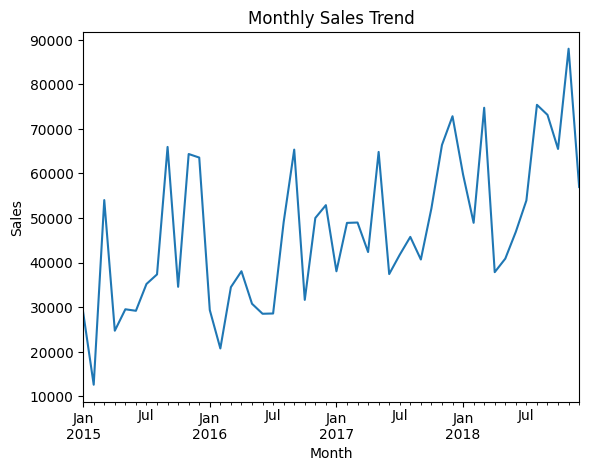
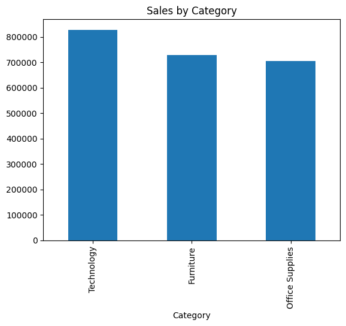
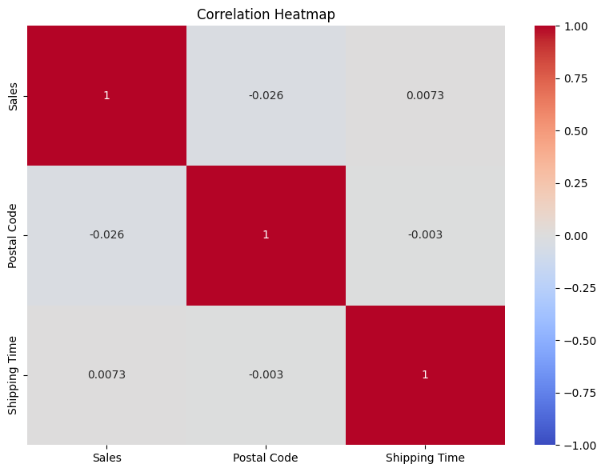
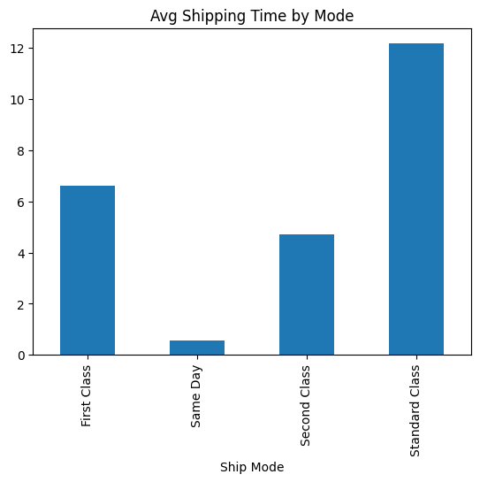

# Sales Performance Analysis Project

## Overview
This project analyzes a sales dataset containing **9,800 records** of orders, spanning customer details, product categories, shipping information, and sales figures. The goal is to uncover trends, identify key drivers of revenue, and provide actionable insights for a hypothetical e-commerce or retail business. Built as a portfolio piece, it showcases data cleaning, exploratory data analysis (EDA), visualization, and advanced analytics skills.

- **Dataset:** 18 columns including `Order Date`, `Sales`, `Category`, `Region`, etc.
- **Tools:** Python (Pandas, Matplotlib, Seaborn), Jupyter Notebook
- **Skills Demonstrated:** Data wrangling, visualization, statistical analysis, storytelling

---

## Project Structure
1. **Data Cleaning**
   - Handled 11 missing `Postal Code` values
   - Converted `Order Date` and `Ship Date` to datetime
   - Engineered `Shipping Time` feature

2. **Exploratory Data Analysis (EDA)**
   - Visualized sales trends, category performance, regional distribution, and more
   - Key visuals:
     - Line chart: Monthly sales trends
     - Bar chart: Sales by category
     - Heatmap: Correlations (e.g., Sales vs. Shipping Time)
     - Bar chart: Sales by region
     - Box plot: Sales distribution by sub-category

3. **Insights**
   - Identified seasonal sales peaks (e.g., Q4 spikes)
   - Highlighted top-performing categories and regions
   - Analyzed shipping efficiency

---

## Key Visualizations
Below are sample outputs from the analysis (replace with your actual images):

- **Monthly Sales Trend**  
  

- **Sales by Category**  
  

- **Correlation Heatmap**  
  

- **Average Shipping Distribution**  
  

---

## Setup and Usage
### Prerequisites
- Python 3.x
- Libraries: `pandas`, `matplotlib`, `seaborn`

  **Install dependencies**
  ``` bash
  pip install -r requirements.txt
  ```
  **Dataset**
The dataset is not included due to size/privacy. Replace cleaned_data.csv in the notebook with your own sales data in a similar format (see structure in notebook).

**About This Project**
This project was developed to enhance my data analysis skills and serve as a portfolio piece. It demonstrates my ability to:

- Clean and preprocess messy data
- Visualize insights effectively
- Derive actionable business recommendations
- Feel free to explore the notebook, adapt the code, or suggest improvements!


---

### Notes for Customization
1. **Images:** After running your notebook, save the plots (e.g., `plt.savefig('images/monthly_sales_trend.png')`) and upload them to an `images/` folder in your GitHub repo. Update the paths in the README.
2. **Username:** Replace `yourusername` with your GitHub handle and update links.
3. **Findings:** Adjust the "Key Findings" section based on your actual results (e.g., specific months, categories, or regions).
4. **Requirements File:** Create a `requirements.txt` with:

- pandas
- matplotlib
- seaborn
- jupyter

  Run `pip freeze > requirements.txt` if you use additional libraries.
5. **Repo Name:** Name your GitHub repository something catchy like `sales-analysis-project` or `retail-insights`.

### How to Use
- Copy this Markdown into a file named `README.md` in your project directory.
- Push it to GitHub with your notebook and any images.
- Test the rendering by viewing it on GitHub—it should look polished and professional!

Let me know if you’d like to refine any section further or add more details!
